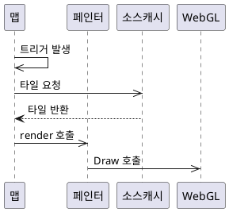
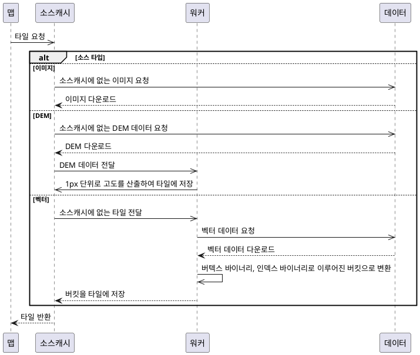

Docs : https://maplibre.org/maplibre-gl-js/docs/ 

GitHub : [maplibre-gl-js](https://github.com/maplibre/maplibre-gl-js)

Version : 3.3.1 ( Latest )

2020년 Mapbox GL JS의 MIT 라이센스 버전에서 포크되어 시작되었으며,
WebGL을 사용하여 브라우저에 지도를 렌더링하는 TypeScript 라이브러리입니다.

> WebGL v2.0 : OpenGL ES v3.0 기반으로 만들어졌으며 MapLibre GL JS v3.0.0 버전 부터 적용

> Mapbox GL JS : Mapbox Style을 Mapbox VectorTile에 준수하는 벡터 타일에 적용하여 WebGL로 렌더링 하는 JavaScript라이브러리, v1.13이 포크되어 MapLibre GL JS에 적용







### 래스터 이미지일 경우

1. 맵에서 트리거 발생
2. 소스캐시로 WegGL에 그릴 타일 요청
3. 소스캐시에 없는 타일의 이미지를 요청
4. 이미지를 다운로드하여 각 타일에 넣어서 반환
5. 페인터의 렌더링 호출
6. 타일의 GPU에 로드하여 렌더링


### DEM 데이터일 경우

1. 맵에서 트리거 발생
2. 소스캐시로 WegGL에 그릴 타일 요청
3. 소스캐시에 없는 타일의 DEM데이터를 요청
4. 다운로드받은 DEM을 워커에 전달
5. 워커에서 1px단위로 DEM데이터의 고도를 각 타일에 넣어서 반환
6. 페인터의 렌더링 호출
7. 타일의 GPU에 로드하여 렌더링
   

### 벡터일 경우

1. 맵에서 트리거 발생
2. 소스캐시로 WegGL에 그릴 타일 요청
3. 소스캐시에 없는 타일을 워커에 요청
4. 워커에서 소스를 다운로드하여 파싱
5. 버텍스와 인덱스가 바이너리로 이루어진 버킷으로 변환
6. 버킷을 각 타일에 넣어서 메인스레드의 소스캐시에 반환
7. 페인터의 렌더링 호출
8. 타일을 GPU에 로드하여 렌더링


```typescript
//1. 맵에서 트리거 발생 후 _render 호출
//map.ts 
map._render(paintStartTimeStamp: number) {

    this.style._updateSources(this.transform);


    this.painter.render(this.style, option);
}
//style.ts 
style._updateSources(transform: Transform) {
        for (const id in this.sourceCaches) {
            this.sourceCaches[id].update(transform, this.map.terrain);
        }
    }


//2. 소스캐시로 WebGl에 그릴 타일 요청
//source_cache.ts 
sourceCaches.update(transform: Transform, terrain?: Terrain) {

    this._addTile(tileID: OverscaledTileID){
        this._loadTile(_loadTile(tile: Tile, callback: Callback<void>){
            return this._source.loadTile(tile, callback);
        }
    }
}

//3. 소스 타입에 따른 데이터 요청
//source.ts
/*
raster_tile_source
raster_dem_tile_source
image_source
geojson_source
vector_tile_source
*/
loadTile(tile: Tile, callback: Callback<void>): void;

//geojson 과 vector_tile의 경우 워커에서 요청
//worker.ts
    loadTile(mapId: string, params: WorkerTileParameters & {
        type: string;
    }, callback: WorkerTileCallback) {
        this.getWorkerSource(mapId, params.type, params.source).loadTile(params, callback);
    }

//geojson 과 vector_tile의 경우 워커에서 요청
//woerker_source.ts
/*
geojson_worker_source
vector_tile_source
rater_dem_tile_source
*/
//vector_tile_source.ts
loadTile(params: WorkerTileParameters, callback: WorkerTileCallback) {
    workerTile.parse()
}

//worker_tile.ts
parse(data: VectorTile, layerIndex: StyleLayerIndex, availableImages: Array<string>, actor: Actor, callback: WorkerTileCallback) {
    const bucket = buckets[layer.id] = layer.createBucket({
        
    });

    bucket.populate(features, options, this.tileID.canonical);

    callback(null, {
        buckets
        ...
    });
}

//bucket.ts
/*
circle_bucket
fill_bucket
fill_extrusion_bucket
heatmap_bucket
line_bucket
pattern_bucket
symbol_bucket
*/
populate(features: Array<IndexedFeature>, options: PopulateParameters, canonical: CanonicalTileID) {
    //테셀레이션 과정
}

//
```


변환 식들은 지리적 좌표를 다른 좌표계나 표현 형식으로 변환하는 데 사용됩니다. 각 함수와 식에 대한 자세한 설명은 다음과 같습니다.

### `projectX(x)`

#### 식: 

$$ \text{projectX}(x) = \frac{x}{360} + 0.5 $$
    

- **입력**: 경도 \( x \) (일반적으로 -180에서 180 사이)
- **출력**: 0과 1 사이의 값
- **목적**: 경도를 0과 1 사이의 값으로 정규화합니다.

### `projectY(y)`

#### 식: 

$$\text{projectY}(y) = 0.5 - 0.25 \times \frac{\ln\left(\frac{1 + \sin\left(\frac{y \times \pi}{180}\right)}{1 - \sin\left(\frac{y \times \pi}{180}\right)}\right)}{\pi}$$


- **입력**: 위도 \( y \) (일반적으로 -90에서 90 사이)
- **출력**: 0과 1 사이의 값
- **목적**: 위도를 0과 1 사이의 값으로 정규화합니다.
- **특별한 처리**: 결과가 0 미만이면 0, 1 초과면 1을 반환합니다.

### `transformPoint(x, y, extent, z2, tx, ty)`

#### 식: 

$$\text{transformPoint}(x, y) = \left[ \text{Math.round}( \text{extent} \times (x \times z2 - tx)), \text{Math.round}( \text{extent} \times (y \times z2 - ty)) \right]$$


- **입력**: \( x, y \) 좌표, 확장 값 \( \text{extent} \), \( z2 \) (타일의 줌 레벨에 따른 계수), \( tx, ty \) (타일의 x, y 좌표)
- **출력**: 변환된 \( x, y \) 좌표
- **목적**: 타일의 줌 레벨과 위치에 따라 실제 좌표를 변환합니다.

### `transformTile(tile, extent)`

- **입력**: 타일 객체와 확장 값 \( \text{extent} \)
- **출력**: 변환된 타일 객체
- **목적**: 타일 내의 모든 특성에 대해 좌표를 변환합니다.

이러한 변환 식들은 일반적으로 지도 렌더링, 지리 정보 시스템(GIS), 웹 매핑 등에서 사용됩니다. 이들은 지리적 좌표를 화면 좌표나 타일 좌표로 변환하는 데 필요한 계산을 수행합니다.


이 문제를 해결하기 위해 주어진 식 

$$y2 = 0.5 - 0.25 \times \frac{\ln\left(\frac{1 + \sin\left(\frac{y \times \pi}{180}\right)}{1 - \sin\left(\frac{y \times \pi}{180}\right)}\right)}{\pi} $$
    
을 \( y \)에 대해 풀어야 합니다.

1. \( y2 \)를 주어진 식에 대입합니다.
2. \( \ln \) (자연로그)를 제거합니다.
3. \( \sin \)을 제거합니다.
4. \( y \)를 구합니다.

다음은 이 과정을 Wolfram Language로 구현한 코드입니다.

\( y \)에 대한 역산 식은 다음과 같습니다:


$$ y = 57.29577951308232 \times \text{ArcSin}\left[\frac{(3.69669703 \times 10^8 - 690337 \times e^{12.566370614359172 \times y2})}{(3.69669703 \times 10^8 + 690337 \times e^{12.566370614359172 \times y2})}\right]$$


이 식을 사용하면 주어진 \( y2 \) 값에 대해 \( y \)를 구할 수 있습니다.

### 주의사항
- 이 식은 역함수를 사용하므로 모든 해를 찾을 수 없을 수 있습니다. 완전한 해를 얻으려면 `Reduce` 함수를 사용해야 합니다.
- 계산 오차가 있을 수 있으므로 실제 구현에서는 주의가 필요합니다.