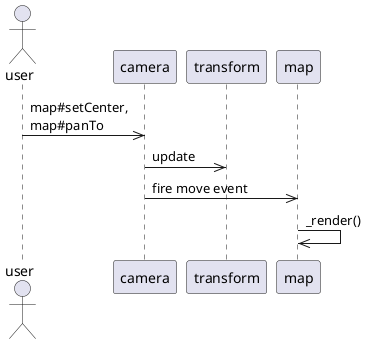
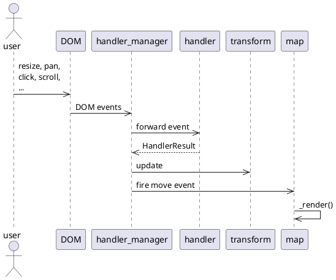
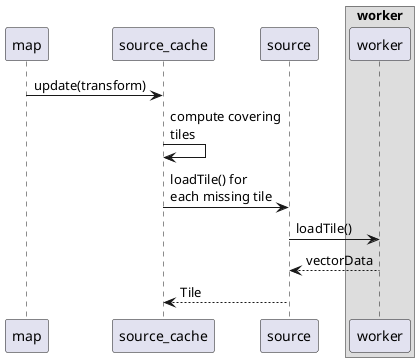
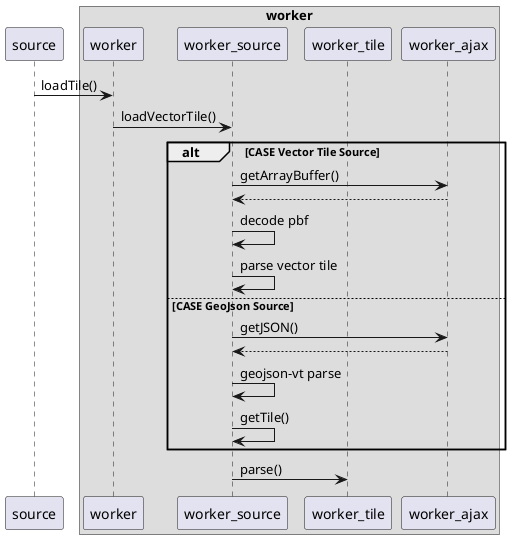
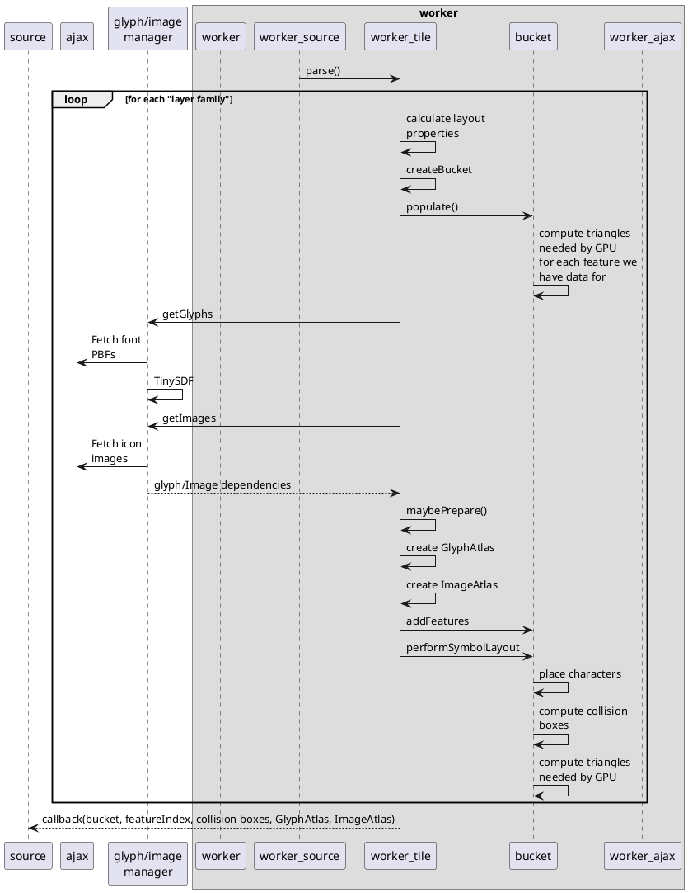
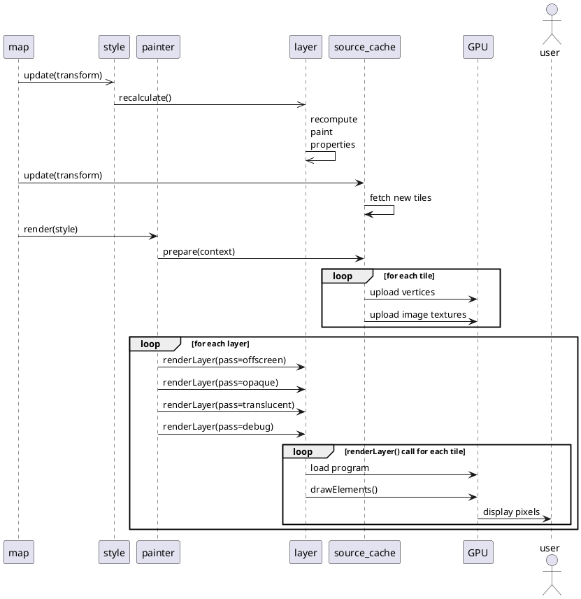

# Architecture
MapLibre GL JS는 `Map` 클래스와 `서브시스템`들로 구성되어있습니다.

`Map`클래스는 지도 컨테이너를 관리하고 사용자와 상호작용 하고 그에 맞게 화면에 렌더링하는 역할을 합니다.

맵이 렌더링 하는 상황은 크게 두 가지로 분류됩니다.

1. `Camera` 클래스의 `panTo()`나 `setCenter()`가 호출되었을 때
2. DOM 이벤트를 통해 `HandlerManeger`가 동작하여 `_updateMapTransform()`이 호출 되었을때

위 두 가지 트리거가 동작하였을 때 `Map._render()`가 동작하여 지도가 업데이트 됩니다.

---
### `Camera` 클래스의 `panTo()`나 `setCenter()`가 호출되었을 때

---
### DOM 이벤트를 통해 `HandlerManeger`가 동작하여 `_updateMapTransform()`이 호출 되었을때

---

MapLibre GL JS에서 렌더링 작업은 메인 스레드와 워커 스레드에서 분리되어 진행됩니다.  
먼저 메인 스레드에서 `source`를 확인하여 데이터가 필요한지 정합니다.  

+ LoadTile
   + 뷰에 잡히는 타일을 계산하여 캐싱되지않은 타일을 요청합니다.
   + 소스가 이미지일 경우 이미지를 메인스레드에 반환해줍니다.
   + 소스가 레스터타일일 경우 이미지 획득하여 타일 행렬을 만들어서 메인스레드에 반환해줍니다.
   + 소스가 레스터DEM타일일 경우 이미지 획득하고 워커스레드를 통해 DEM데이터를 계산하여 타일 행렬을 만들어서 메인스레드에 반환해줍니다.
   + 소스가 벡터타일일 경우 워커스레드를 호출하여 데이터 파싱을 진행합니다.

---
### Load VectorTile

---
+ Parse 
   + 워커스레드에 PBF 데이터를 가져옵니다.
   + `Mapbox`의 `vector-tile-js`를 이용해서 PBF데이터를 디코딩합니다.
   + 디코딩 된 결과는 `WokerTile`로 전달합니다.
---
### Parse

---
+ Layout
   + 추출된 데이터를 `WokrerTile`, `Bucket`, `ProgramConfiguration`를 통해서 
   WebGL 셰이더에서 사용할 수 있는 `Layout`이라 부르는 형태로 변환합니다.
   + `WorkerTile`은 `parse()`를 통해 전달받은 데이터를 타일별로 캐싱합니다.
   + `parse()`에서는 `Bucket`을 통해 WebGL에서 렌더링을 위한 버퍼로 변환합니다.
   + `triangle`을 구성할 수 없는 데이터(글꼴, 이미지, 패턴 등)은 따로 ajax요청을 합니다.
   + 데이터가 모두 처리되면 타일 행렬을 만들어서 메인 스레드에 전달합니다.

---
###  Layout

---
타일 로딩이 완료되면 렌더링이 진행됩니다.

+ SourceCache
   + 캐싱된 데이터는 스타일과 연결하여 지도에 렌더링합니다.
+ Render
    + 변화된 지도 상태를 기반으로 Paint 속성을 다시 계산합니다.
    + `SourceCache`로 부터 타일을 가져옵니다.
    + 각 타일의 레이어에 대해 `Bucket`클래스에서 렌더링에 필요한 모든 버텍스를 GPU에 로드합니다.
    + 각 레이어에서는 다음과 같은 4개의 `renderLayer()` 과정을 진행합니다.
      + `offscreen`는 사용자 정의레이어, 힐 쉐이딩 레이어, 히트맵 레이어를 GPU로 계산합니다.
      + `opaque`는 배경레이어를 렌더링합니다.
      + `translucent`는 각각의 레이어를 렌더링합니다.
      + `debug`는 collisionBox, boundaries, 기타 등을 렌더링합니다.
    + `renderLayer()`는 WebGL의 `drawElements()`를 호출하여 GPU를 사용해서 사용자에게 제공합니다.
+ finish
   + 렌더링할 작업이 더 있으면 `Map.triggerRepaint()`를 호출합니다.
   + 그렇지 않다면 `idle` 이벤트를 트리거합니다.

###  Rendering
